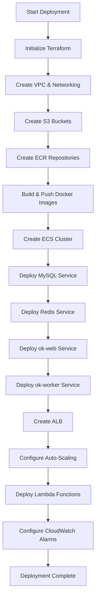
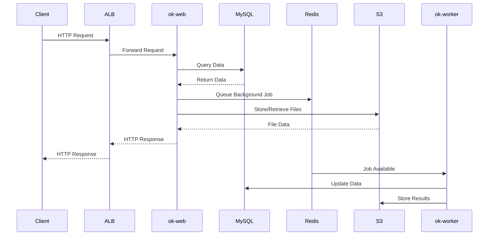
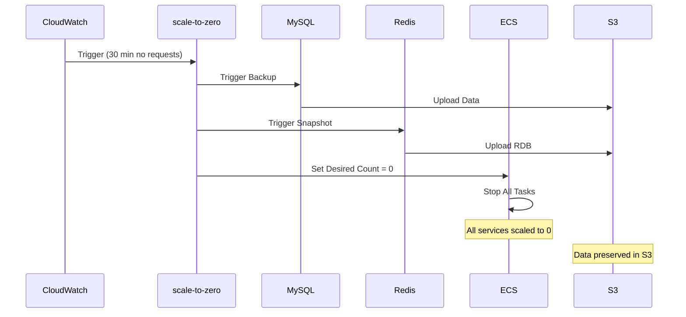

# AWS Deployment Architecture Diagrams

## Standard Architecture (ALB Always-On)

### High-Level Architecture

```
┌─────────────────────────────────────────────────────────────────────────────┐
│                              Internet                                        │
└────────────────────────────────┬────────────────────────────────────────────┘
                                 │
                                 │ HTTPS/HTTP
                                 ▼
┌─────────────────────────────────────────────────────────────────────────────┐
│                         AWS Cloud (Region: us-west-2)                        │
│                                                                              │
│  ┌────────────────────────────────────────────────────────────────────────┐ │
│  │                    Route 53 (Optional DNS)                             │ │
│  └────────────────────────────────┬───────────────────────────────────────┘ │
│                                   │                                          │
│  ┌────────────────────────────────▼───────────────────────────────────────┐ │
│  │              Application Load Balancer (ALB)                           │ │
│  │              - Health checks on /healthz                               │ │
│  │              - SSL/TLS termination                                     │ │
│  │              - Target: ok-web ECS service                              │ │
│  └────────────────────────────────┬───────────────────────────────────────┘ │
│                                   │                                          │
│  ┌────────────────────────────────────────────────────────────────────────┐ │
│  │                         VPC (10.0.0.0/16)                              │ │
│  │                                                                         │ │
│  │  ┌──────────────────────┐         ┌──────────────────────┐            │ │
│  │  │   Public Subnet      │         │   Public Subnet      │            │ │
│  │  │   10.0.1.0/24        │         │   10.0.2.0/24        │            │ │
│  │  │   (us-west-2a)       │         │   (us-west-2b)       │            │ │
│  │  │                      │         │                      │            │ │
│  │  │  ┌────────────────┐  │         │                      │            │ │
│  │  │  │  NAT Gateway   │  │         │                      │            │ │
│  │  │  │  (Single AZ)   │  │         │                      │            │ │
│  │  │  └────────┬───────┘  │         │                      │            │ │
│  │  │           │           │         │                      │            │ │
│  │  │  ┌────────▼────────┐ │         │                      │            │ │
│  │  │  │ Internet Gateway│ │         │                      │            │ │
│  │  │  └─────────────────┘ │         │                      │            │ │
│  │  └──────────────────────┘         └──────────────────────┘            │ │
│  │                                                                         │ │
│  │  ┌──────────────────────┐         ┌──────────────────────┐            │ │
│  │  │  Private Subnet      │         │  Private Subnet      │            │ │
│  │  │  10.0.10.0/24        │         │  10.0.11.0/24        │            │ │
│  │  │  (us-west-2a)        │         │  (us-west-2b)        │            │ │
│  │  │                      │         │                      │            │ │
│  │  │  ┌────────────────┐  │         │  ┌────────────────┐  │            │ │
│  │  │  │ ECS Fargate    │  │         │  │ ECS Fargate    │  │            │ │
│  │  │  │                │  │         │  │                │  │            │ │
│  │  │  │ ┌────────────┐ │  │         │  │ ┌────────────┐ │  │            │ │
│  │  │  │ │  ok-web    │ │  │         │  │ │ ok-worker  │ │  │            │ │
│  │  │  │ │  (Flask)   │ │  │         │  │ │   (RQ)     │ │  │            │ │
│  │  │  │ │ 0.25 vCPU  │ │  │         │  │ │ 0.25 vCPU  │ │  │            │ │
│  │  │  │ │  512 MB    │ │  │         │  │ │  512 MB    │ │  │            │ │
│  │  │  │ └──────┬─────┘ │  │         │  │ └──────┬─────┘ │  │            │ │
│  │  │  │        │       │  │         │  │        │       │  │            │ │
│  │  │  │ ┌──────▼─────┐ │  │         │  │ ┌──────▼─────┐ │  │            │ │
│  │  │  │ │   MySQL    │ │  │         │  │ │   Redis    │ │  │            │ │
│  │  │  │ │   8.0      │ │  │         │  │ │    7.0     │ │  │            │ │
│  │  │  │ │ 0.5 vCPU   │ │  │         │  │ │ 0.25 vCPU  │ │  │            │ │
│  │  │  │ │   1 GB     │ │  │         │  │ │  512 MB    │ │  │            │ │
│  │  │  │ │            │ │  │         │  │ │            │ │  │            │ │
│  │  │  │ │ +S3 Sync   │ │  │         │  │ │ +S3 Snap   │ │  │            │ │
│  │  │  │ │ (15 min)   │ │  │         │  │ │ (hourly)   │ │  │            │ │
│  │  │  │ └────────────┘ │  │         │  │ └────────────┘ │  │            │ │
│  │  │  └────────────────┘  │         │  └────────────────┘  │            │ │
│  │  └──────────────────────┘         └──────────────────────┘            │ │
│  │                                                                         │ │
│  └─────────────────────────────────────────────────────────────────────────┘ │
│                                                                              │
│  ┌─────────────────────────────────────────────────────────────────────────┐ │
│  │                         Storage & Services                              │ │
│  │                                                                         │ │
│  │  ┌──────────────┐  ┌──────────────┐  ┌──────────────┐  ┌────────────┐ │ │
│  │  │      S3      │  │      S3      │  │      S3      │  │    ECR     │ │ │
│  │  │  (App Files) │  │ (MySQL Data) │  │ (Redis Data) │  │  (Images)  │ │ │
│  │  │              │  │              │  │              │  │            │ │ │
│  │  │ ok-storage-  │  │ ok-mysql-    │  │ ok-redis-    │  │  ok-web    │ │ │
│  │  │    {env}     │  │  data-{env}  │  │  data-{env}  │  │  ok-worker │ │ │
│  │  └──────────────┘  └──────────────┘  └──────────────┘  └────────────┘ │ │
│  │                                                                         │ │
│  │  ┌──────────────┐  ┌──────────────┐  ┌──────────────┐                │ │
│  │  │  CloudWatch  │  │   Secrets    │  │  CloudWatch  │                │ │
│  │  │    Logs      │  │   Manager    │  │    Alarms    │                │ │
│  │  │              │  │              │  │              │                │ │
│  │  │ /ecs/ok-web  │  │ DB Creds     │  │ Scale-to-0   │                │ │
│  │  │ /ecs/worker  │  │ OAuth Keys   │  │ High CPU     │                │ │
│  │  │ /ecs/mysql   │  │ SendGrid     │  │ Health Check │                │ │
│  │  │ /ecs/redis   │  │ Session Key  │  │              │                │ │
│  │  └──────────────┘  └──────────────┘  └──────────────┘                │ │
│  └─────────────────────────────────────────────────────────────────────────┘ │
│                                                                              │
│  ┌─────────────────────────────────────────────────────────────────────────┐ │
│  │                      Lambda Functions                                   │ │
│  │                                                                         │ │
│  │  ┌──────────────────────┐         ┌──────────────────────┐            │ │
│  │  │  scale-to-zero       │         │    scale-up          │            │ │
│  │  │                      │         │                      │            │ │
│  │  │  Triggered by:       │         │  Triggered by:       │            │ │
│  │  │  - No requests       │         │  - ALB requests      │            │ │
│  │  │    for 30 min        │         │  - Manual invoke     │            │ │
│  │  │                      │         │                      │            │ │
│  │  │  Actions:            │         │  Actions:            │            │ │
│  │  │  - Backup to S3      │         │  - Restore from S3   │            │ │
│  │  │  - Scale ECS to 0    │         │  - Scale ECS to 1    │            │ │
│  │  └──────────────────────┘         └──────────────────────┘            │ │
│  └─────────────────────────────────────────────────────────────────────────┘ │
└─────────────────────────────────────────────────────────────────────────────┘
```

## True Zero-Cost Architecture (API Gateway + Lambda)

### High-Level Architecture

```
┌─────────────────────────────────────────────────────────────────────────────┐
│                              Internet                                        │
└────────────────────────────────┬────────────────────────────────────────────┘
                                 │
                                 │ HTTPS/HTTP
                                 ▼
┌─────────────────────────────────────────────────────────────────────────────┐
│                         AWS Cloud (Region: us-west-2)                        │
│                                                                              │
│  ┌────────────────────────────────────────────────────────────────────────┐ │
│  │                    Route 53 (Optional DNS)                             │ │
│  └────────────────────────────────┬───────────────────────────────────────┘ │
│                                   │                                          │
│  ┌────────────────────────────────▼───────────────────────────────────────┐ │
│  │              API Gateway HTTP API                                      │ │
│  │              - Pay-per-request ($0 when idle)                          │ │
│  │              - Custom domain support                                   │ │
│  │              - Throttling: 100 req/sec                                 │ │
│  └────────────────────────────────┬───────────────────────────────────────┘ │
│                                   │                                          │
│                                   ▼                                          │
│  ┌────────────────────────────────────────────────────────────────────────┐ │
│  │              Lambda: ALB Lifecycle Manager                             │ │
│  │              - Checks if ALB exists                                    │ │
│  │              - Creates ALB if needed (CloudFormation)                  │ │
│  │              - Returns "warming up" message                            │ │
│  │              - Proxies requests once ready                             │ │
│  │              - Timeout: 29 seconds                                     │ │
│  └────────────────────────────────┬───────────────────────────────────────┘ │
│                                   │                                          │
│                                   ▼ (when ALB exists)                        │
│  ┌────────────────────────────────────────────────────────────────────────┐ │
│  │              Application Load Balancer (Created on-demand)             │ │
│  │              - Destroyed after 30 min idle                             │ │
│  │              - Same config as Standard Architecture                    │ │
│  └────────────────────────────────┬───────────────────────────────────────┘ │
│                                   │                                          │
│                                   ▼                                          │
│  ┌────────────────────────────────────────────────────────────────────────┐ │
│  │                         VPC (10.0.0.0/16)                              │ │
│  │                    (Same as Standard Architecture)                     │ │
│  │                                                                         │ │
│  │              ECS Services scaled up with ALB creation                  │ │
│  └─────────────────────────────────────────────────────────────────────────┘ │
│                                                                              │
│  ┌─────────────────────────────────────────────────────────────────────────┐ │
│  │                      Lambda Functions                                   │ │
│  │                                                                         │ │
│  │  ┌──────────────────────┐         ┌──────────────────────┐            │ │
│  │  │  scale-to-zero       │         │  alb-lifecycle       │            │ │
│  │  │                      │         │                      │            │ │
│  │  │  Triggered by:       │         │  Triggered by:       │            │ │
│  │  │  - No requests       │         │  - API Gateway       │            │ │
│  │  │    for 30 min        │         │  - Every request     │            │ │
│  │  │                      │         │                      │            │ │
│  │  │  Actions:            │         │  Actions:            │            │ │
│  │  │  - Backup to S3      │         │  - Check ALB exists  │            │ │
│  │  │  - Scale ECS to 0    │         │  - Create if needed  │            │ │
│  │  │  - Delete ALB        │         │  - Proxy requests    │            │ │
│  │  └──────────────────────┘         └──────────────────────┘            │ │
│  └─────────────────────────────────────────────────────────────────────────┘ │
└─────────────────────────────────────────────────────────────────────────────┘
```

## Data Flow Diagrams

### Request Flow (Standard Architecture)

```
┌──────────┐
│  Client  │
└────┬─────┘
     │
     │ 1. HTTPS Request
     ▼
┌─────────────────┐
│  Route 53 DNS   │
└────┬────────────┘
     │
     │ 2. Resolve to ALB
     ▼
┌─────────────────┐
│      ALB        │
│  (Always On)    │
└────┬────────────┘
     │
     │ 3. Forward to Target
     ▼
┌─────────────────┐
│   ok-web ECS    │
│   (Fargate)     │
└────┬────────────┘
     │
     │ 4. Query Database
     ▼
┌─────────────────┐
│  MySQL ECS      │
│  (Fargate)      │
│                 │
│  ┌───────────┐  │
│  │ Container │  │
│  │   Data    │  │
│  └─────┬─────┘  │
│        │        │
│        │ 5. Sync every 15 min
│        ▼        │
│  ┌───────────┐  │
│  │    S3     │  │
│  │  Backup   │  │
│  └───────────┘  │
└─────────────────┘
```

### Scale-to-Zero Flow

```
┌─────────────────┐
│   CloudWatch    │
│     Alarm       │
│                 │
│ No requests for │
│   30 minutes    │
└────┬────────────┘
     │
     │ 1. Trigger
     ▼
┌─────────────────┐
│ scale-to-zero   │
│    Lambda       │
└────┬────────────┘
     │
     │ 2. Backup MySQL to S3
     ▼
┌─────────────────┐
│  MySQL ECS      │
│                 │
│  Flush & Backup │
└────┬────────────┘
     │
     │ 3. Backup Redis to S3
     ▼
┌─────────────────┐
│  Redis ECS      │
│                 │
│  RDB Snapshot   │
└────┬────────────┘
     │
     │ 4. Scale all services to 0
     ▼
┌─────────────────┐
│   ECS Cluster   │
│                 │
│ Desired: 0      │
│ Running: 0      │
└─────────────────┘
```

### Scale-Up Flow

```
┌──────────┐
│  Client  │
│  Request │
└────┬─────┘
     │
     │ 1. HTTP Request
     ▼
┌─────────────────┐
│      ALB        │
│  (Always On)    │
└────┬────────────┘
     │
     │ 2. No healthy targets
     │    Trigger alarm
     ▼
┌─────────────────┐
│   CloudWatch    │
│     Alarm       │
└────┬────────────┘
     │
     │ 3. Invoke Lambda
     ▼
┌─────────────────┐
│   scale-up      │
│    Lambda       │
└────┬────────────┘
     │
     │ 4. Restore MySQL from S3
     ▼
┌─────────────────┐
│  MySQL ECS      │
│                 │
│  Load from S3   │
└────┬────────────┘
     │
     │ 5. Restore Redis from S3
     ▼
┌─────────────────┐
│  Redis ECS      │
│                 │
│  Load RDB       │
└────┬────────────┘
     │
     │ 6. Scale services to 1
     ▼
┌─────────────────┐
│   ECS Cluster   │
│                 │
│ Desired: 1      │
│ Running: 1      │
└────┬────────────┘
     │
     │ 7. Register with ALB
     ▼
┌─────────────────┐
│      ALB        │
│                 │
│ Healthy targets │
└────┬────────────┘
     │
     │ 8. Forward request
     ▼
┌─────────────────┐
│   ok-web ECS    │
│                 │
│ Process request │
└─────────────────┘
```

## Network Diagram

```
┌─────────────────────────────────────────────────────────────────────────────┐
│                              VPC (10.0.0.0/16)                               │
│                                                                              │
│  ┌────────────────────────────────────────────────────────────────────────┐ │
│  │                         Public Subnets                                 │ │
│  │                                                                         │ │
│  │  ┌──────────────────────────┐    ┌──────────────────────────┐         │ │
│  │  │  10.0.1.0/24 (AZ-a)      │    │  10.0.2.0/24 (AZ-b)      │         │ │
│  │  │                          │    │                          │         │ │
│  │  │  ┌────────────────────┐  │    │                          │         │ │
│  │  │  │  Internet Gateway  │  │    │                          │         │ │
│  │  │  └─────────┬──────────┘  │    │                          │         │ │
│  │  │            │             │    │                          │         │ │
│  │  │  ┌─────────▼──────────┐  │    │                          │         │ │
│  │  │  │   NAT Gateway      │  │    │                          │         │ │
│  │  │  │   (Elastic IP)     │  │    │                          │         │ │
│  │  │  └────────────────────┘  │    │                          │         │ │
│  │  │                          │    │                          │         │ │
│  │  │  ┌────────────────────┐  │    │  ┌────────────────────┐  │         │ │
│  │  │  │   ALB (AZ-a)       │  │    │  │   ALB (AZ-b)       │  │         │ │
│  │  │  └────────────────────┘  │    │  └────────────────────┘  │         │ │
│  │  └──────────────────────────┘    └──────────────────────────┘         │ │
│  └─────────────────────────────────────────────────────────────────────────┘ │
│                                                                              │
│  ┌─────────────────────────────────────────────────────────────────────────┐ │
│  │                        Private Subnets                                  │ │
│  │                                                                         │ │
│  │  ┌──────────────────────────┐    ┌──────────────────────────┐         │ │
│  │  │  10.0.10.0/24 (AZ-a)     │    │  10.0.11.0/24 (AZ-b)     │         │ │
│  │  │                          │    │                          │         │ │
│  │  │  ┌────────────────────┐  │    │  ┌────────────────────┐  │         │ │
│  │  │  │   ok-web           │  │    │  │   ok-worker        │  │         │ │
│  │  │  │   (Fargate)        │  │    │  │   (Fargate)        │  │         │ │
│  │  │  └────────────────────┘  │    │  └────────────────────┘  │         │ │
│  │  │                          │    │                          │         │ │
│  │  │  ┌────────────────────┐  │    │  ┌────────────────────┐  │         │ │
│  │  │  │   MySQL            │  │    │  │   Redis            │  │         │ │
│  │  │  │   (Fargate)        │  │    │  │   (Fargate)        │  │         │ │
│  │  │  └────────────────────┘  │    │  └────────────────────┘  │         │ │
│  │  │                          │    │                          │         │ │
│  │  │  Route to NAT Gateway ───┼────┼──────────────────────────┤         │ │
│  │  │  for internet access     │    │                          │         │ │
│  │  └──────────────────────────┘    └──────────────────────────┘         │ │
│  └─────────────────────────────────────────────────────────────────────────┘ │
└─────────────────────────────────────────────────────────────────────────────┘

Security Groups:
┌─────────────────┐     ┌─────────────────┐     ┌─────────────────┐
│   ALB SG        │────▶│   ECS SG        │────▶│  MySQL SG       │
│                 │     │                 │     │                 │
│ Ingress:        │     │ Ingress:        │     │ Ingress:        │
│ - 80 (0.0.0.0)  │     │ - All from ALB  │     │ - 3306 from ECS │
│ - 443 (0.0.0.0) │     │                 │     │                 │
│                 │     │ Egress:         │     │ Egress:         │
│ Egress:         │     │ - All           │     │ - All           │
│ - All to ECS    │     │                 │     │                 │
└─────────────────┘     └─────────────────┘     └─────────────────┘
                                │
                                │
                                ▼
                        ┌─────────────────┐
                        │   Redis SG      │
                        │                 │
                        │ Ingress:        │
                        │ - 6379 from ECS │
                        │                 │
                        │ Egress:         │
                        │ - All           │
                        └─────────────────┘
```

## Deployment State Diagram

```
┌─────────────┐
│   Initial   │
│   (Empty)   │
└──────┬──────┘
       │
       │ terraform apply
       ▼
┌─────────────┐
│  Creating   │
│ Resources   │
└──────┬──────┘
       │
       │ 10-15 minutes
       ▼
┌─────────────┐
│   Running   │◀────────────────┐
│  (Active)   │                 │
└──────┬──────┘                 │
       │                        │
       │ No requests            │ New request
       │ for 30 min             │ arrives
       ▼                        │
┌─────────────┐                 │
│  Scaling    │                 │
│    Down     │                 │
└──────┬──────┘                 │
       │                        │
       │ 2-3 minutes            │
       ▼                        │
┌─────────────┐                 │
│   Scaled    │                 │
│   to Zero   │                 │
└──────┬──────┘                 │
       │                        │
       │ Request arrives        │
       ▼                        │
┌─────────────┐                 │
│  Scaling    │                 │
│     Up      │─────────────────┘
└──────┬──────┘
       │
       │ 2-3 minutes
       │
       └──────────────────────────┐
                                  │
                                  ▼
                          ┌─────────────┐
                          │  Destroying │
                          │  (terraform │
                          │   destroy)  │
                          └──────┬──────┘
                                 │
                                 │ 5-10 minutes
                                 ▼
                          ┌─────────────┐
                          │  Destroyed  │
                          │ (Data in S3)│
                          └─────────────┘
```

## Cost State Diagram

```
                    ┌──────────────────────────────────┐
                    │     Standard Architecture        │
                    └──────────────────────────────────┘

┌─────────────┐     ┌─────────────┐     ┌─────────────┐
│   Running   │────▶│   Scaled    │────▶│  Destroyed  │
│   24/7      │     │   to Zero   │     │             │
│             │     │             │     │             │
│ $93-103/mo  │     │  $23/mo     │     │   $0/mo     │
│             │     │             │     │ (S3 only)   │
└─────────────┘     └─────────────┘     └─────────────┘
      ▲                    ▲
      │                    │
      │  8hr/day,          │
      │  5 days/wk         │
      │                    │
      │  $45-50/mo         │
      └────────────────────┘


                    ┌──────────────────────────────────┐
                    │   True Zero-Cost Architecture    │
                    └──────────────────────────────────┘

┌─────────────┐     ┌─────────────┐     ┌─────────────┐
│   Running   │────▶│   Scaled    │────▶│  Destroyed  │
│   24/7      │     │   to Zero   │     │             │
│             │     │  (No ALB)   │     │             │
│ $93-103/mo  │     │             │     │   $0/mo     │
│             │     │  $2-3/mo    │     │ (S3 only)   │
└─────────────┘     └─────────────┘     └─────────────┘
      ▲                    ▲
      │                    │
      │  8hr/day,          │
      │  5 days/wk         │
      │                    │
      │  $25-30/mo         │
      └────────────────────┘
```

## Component Interaction Diagram

```
┌──────────────────────────────────────────────────────────────────────────┐
│                         Component Interactions                            │
└──────────────────────────────────────────────────────────────────────────┘

    ┌─────────┐
    │ ok-web  │
    │ (Flask) │
    └────┬────┘
         │
         │ 1. Read/Write Files
         ▼
    ┌─────────┐
    │   S3    │
    │ Storage │
    └─────────┘
         │
         │ 2. Query Database
         ▼
    ┌─────────┐         ┌─────────┐
    │  MySQL  │────────▶│   S3    │
    │   ECS   │  Sync   │  MySQL  │
    └────┬────┘ 15 min  │  Data   │
         │              └─────────┘
         │ 3. Queue Jobs
         ▼
    ┌─────────┐         ┌─────────┐
    │  Redis  │────────▶│   S3    │
    │   ECS   │  Snap   │  Redis  │
    └────┬────┘ Hourly  │  Data   │
         │              └─────────┘
         │ 4. Process Jobs
         ▼
    ┌─────────┐
    │ok-worker│
    │  (RQ)   │
    └────┬────┘
         │
         │ 5. Send Emails
         ▼
    ┌─────────┐
    │SendGrid │
    │   API   │
    └─────────┘
         │
         │ 6. Log Events
         ▼
    ┌─────────┐
    │CloudWtch│
    │  Logs   │
    └─────────┘
         │
         │ 7. Trigger Alarms
         ▼
    ┌─────────┐
    │CloudWtch│
    │ Alarms  │
    └────┬────┘
         │
         │ 8. Invoke Lambda
         ▼
    ┌─────────┐
    │ Lambda  │
    │ Scale   │
    └─────────┘
```

## Mermaid Diagrams

### Deployment Flow



### Request Processing Flow



### Scale-to-Zero Sequence



## Infrastructure Components Summary

| Component | Type | Purpose | Cost (Idle) | Cost (Active) |
|-----------|------|---------|-------------|---------------|
| VPC | Network | Isolation | $0 | $0 |
| ALB | Load Balancer | Traffic routing | $20/mo | $20/mo |
| NAT Gateway | Network | Outbound internet | $0 (scaled) | $35/mo |
| ECS Fargate | Compute | Container hosting | $0 (scaled) | $30-40/mo |
| S3 | Storage | Data persistence | $2/mo | $5/mo |
| ECR | Registry | Image storage | $1/mo | $1/mo |
| CloudWatch | Monitoring | Logs & alarms | $1/mo | $3/mo |
| Secrets Manager | Security | Credentials | $1/mo | $1/mo |
| Lambda | Compute | Auto-scaling | $0 | $1/mo |
| **Total** | | | **$23-25/mo** | **$93-103/mo** |
